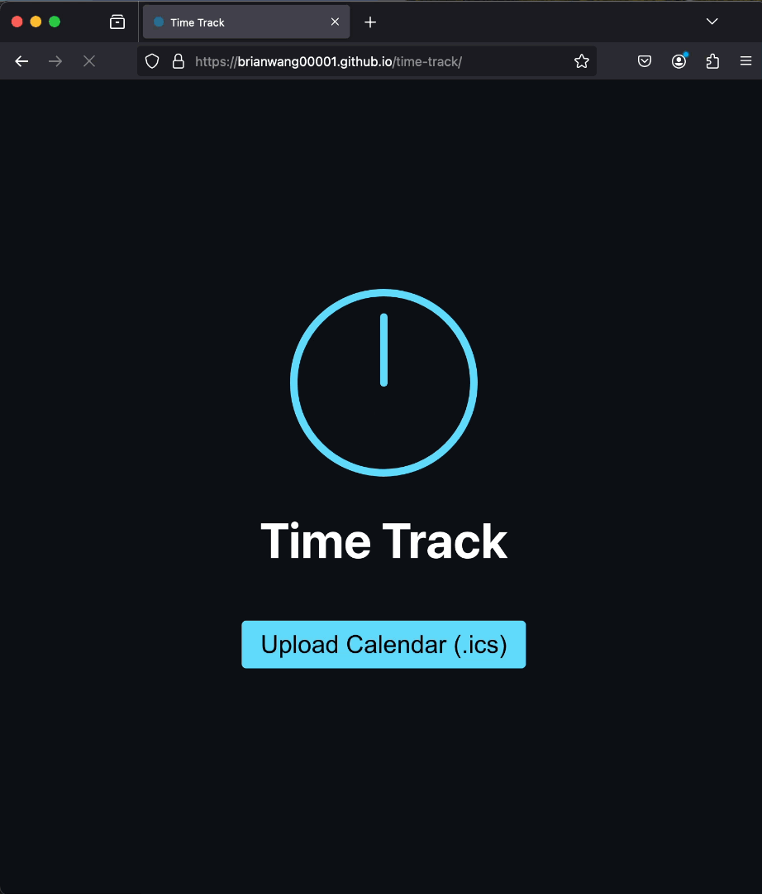

# Time Track

Time Track is a simple web application that helps you visualize your time spent on various activities and do some editting. It allows you to upload your calendar data in ICS format, analyze your time allocation, and make adjustments to your data, such as renaming events and removing events.

  
  

## Application

Access the Time Track app here: [Time Track](https://brianwang00001.github.io/time-track/)

## Usage

1. **Upload**: Start by uploading your ICS file on the home page.
2. **Chart**: View a bar chart of your time allocation.
3. **Rename**: Consolidate similar events by renaming them.
4. **Remove**: Selectively remove events from your dataset.
5. **Export**: Export your modified calendar data back to ICS format.

## Getting Started

1. Clone this repository
2. Install dependencies with `npm install`
3. Start the development server with `npm start`
4. Open [http://localhost:3000](http://localhost:3000) to view it in the browser

## Known Issues

- The clock logo animation may not display correctly on some versions of Safari and I don't know why.

## Contributing

Contributions are welcome! Please feel free to submit a Pull Request.

## License

MIT
